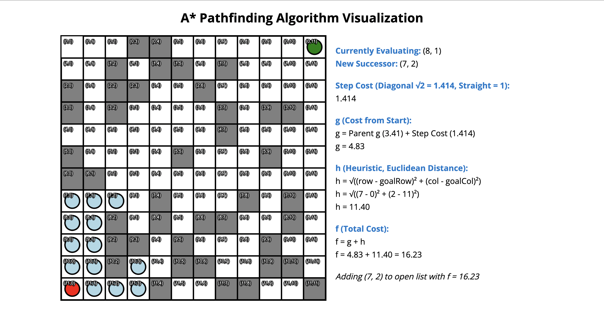

# A* Pathfinding Algorithm Visualization

A web-based visualization of the A* pathfinding algorithm. This project demonstrates how the A* algorithm navigates a grid to find the shortest path from a start to an endpoint while avoiding obstacles. Ideal for educational purposes, this visualization allows users to see the algorithm in action and better understand how pathfinding works.

## Demo

Check out a live demo here: [Will link to a live demo eventually]

## Features

- **Interactive Visualization**: Watch the A* algorithm navigate through obstacles to find the shortest path.
- **Heuristic-Based Calculations**: Uses the Euclidean distance heuristic for accurate pathfinding.
- **Step-by-Step Explanation**: Visual feedback explains each step, including cost and heuristic calculations.
- **Obstacle Randomization**: Each run generates a unique grid with obstacles, ensuring a clear path from start to end.
- **Clear and Simple Interface**: A clean layout with a color-coded grid for easy understanding.

## Technologies Used

- **HTML5** and **CSS3**: For structuring and styling the interface.
- **JavaScript**: Core logic for the A* algorithm and visualization.
- **Canvas API**: Used to render the grid and visualization on the screen.

## Screenshots



## Getting Started

To get a local copy up and running, follow these steps.

### Prerequisites

You'll need a modern web browser that supports HTML5 and JavaScript.

### Installation

1. Clone the repository:
   ```bash
   git clone https://github.com/adrimayy/aStarAlgorithm.git
   ```
2. Navigate to the project folder:
   ```bash
   cd aStarAlgorithm
   ```
3. Open `index.html` in your preferred web browser to see the visualization in action.

### Usage

1. Launch the app by opening `index.html`.
2. Observe the grid with randomly generated obstacles on each refresh.
3. Watch the algorithm find the shortest path from the red start point to the green end point.
4. View the explanations for each cell, including calculations for costs and heuristic values.

### Project Structure

```
aStarAlgorithm/
├── index.html        # Main HTML file for the interface
├── styles.css        # CSS for styling the visualization
├── script.js         # JavaScript file containing the A* algorithm logic
└── README.md         # Project README file
```

## How It Works

The A* algorithm combines concepts from Dijkstra’s Algorithm and Greedy Best-First Search, using:
- **g-cost**: The cost from the start to the current cell.
- **h-cost**: The heuristic estimate from the current cell to the goal (Euclidean distance in this case).
- **f-cost**: The total cost (`f = g + h`) used to determine the best path.

The algorithm continually evaluates and prioritizes cells with the lowest `f` cost until it reaches the end or determines there’s no valid path.

## Contributing

Contributions are welcome! Feel free to open issues, create pull requests, or suggest improvements.

To contribute:

1. Fork the project.
2. Create your feature branch: `git checkout -b feature/AmazingFeature`.
3. Commit your changes: `git commit -m 'Add some AmazingFeature'`.
4. Push to the branch: `git push origin feature/AmazingFeature`.
5. Open a pull request.

## License

Distributed under the MIT License. See `LICENSE` for more information.
